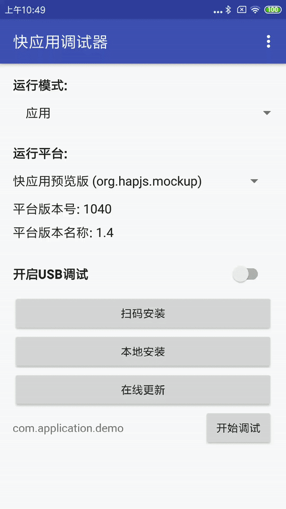

# TodoMVC • Vue

### 简介

快应用是基于手机硬件平台的新型应用形态，具备传统APP完整的应用体验，无需安装、即点即用

该项目是一个快应用版本的TodoMVC应用示例，与[同组织下的todos项目](https://github.com/quickappcn/todos)的区别在于：

本项目使用了**Vue2开源框架（vue作为文件后缀名）**进行开发，后者使用的是快应用**原有标准语法（ux作为文件后缀名）**开发的；

项目中开发者开发方式与网页Vue项目开发一致，可以使用同样的Vue语法；

### 原理

快应用在运行时会将Vue框架注入，以Vue全局变量的形式暴露出来；

开发者在项目开发时，与网页Vue项目开发一致，可以使用Vue本身的各种DSL语法特性；

DOM渲染层面与浏览器相似，且实现不同，所以请不要使用DOM本身的API能力（如：addEventListener），这块能力暂未开放规范；

### 注意事项

- 使用Vue开发并查看效果，需要配合使用1050版本的预览版APK，以达到运行时支持；

- 快应用1050版本开始邀请开发者参与内测；

- 项目接下来可能会有较大的变动，运行时仅支持该项目最新版本，请及时更新；

### 效果预览

### 相关链接

[快应用官网](https://www.quickapp.cn/)

[快应用官网开发文档](https://doc.quickapp.cn/)